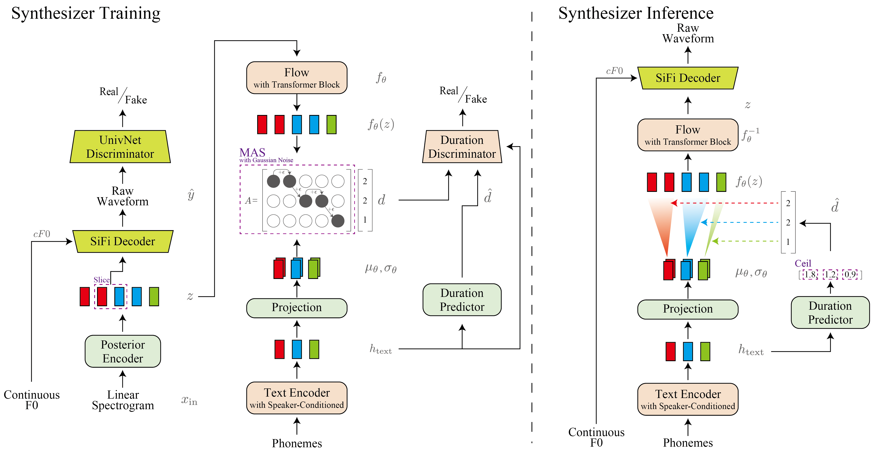
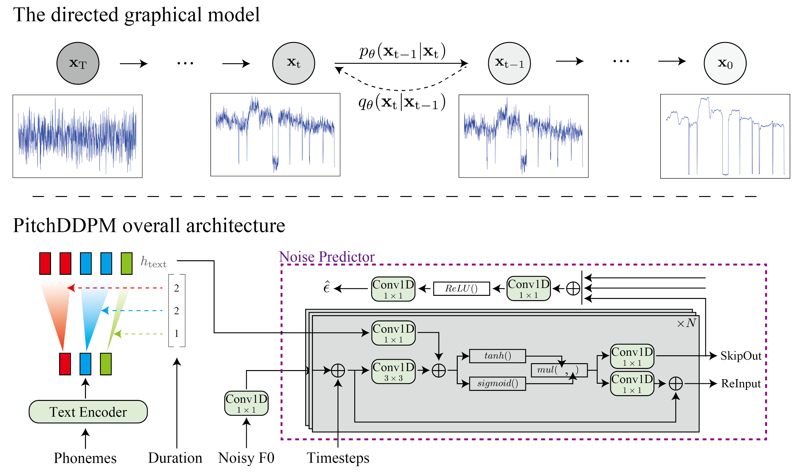

# SiFi-VITS2-44100-Ja
**DDPM-based Pitch Generation and Pitch Controllable Voice Synthesis.**

このリポジトリは、主に[unofficial VITS2](https://github.com/p0p4k/vits2_pytorch)、[SiFi-GAN](https://github.com/chomeyama/SiFiGAN)、及び[RMS Singer](https://arxiv.org/abs/2305.10686)を参考にして作られた、実験用のTTS/SVSモデルです。Pitch生成モデルとTTS/SVS合成モデルは別々に学習を行います。推論の際には、SVSではustファイルから歌声を、TTSでは入力テキストから音声を合成します。また、ピッチの再生成によりピッチや声色の異なる音声生成をすることが可能です。最後に、TTSモデルで歌声を実験的に合成します。




## ⚠Work in Progress⚠

- [x] SVS dataset, preprocess for both
- [x] SVS dataset, training Synthesizer
- [x] SVS dataset, training PitchDDPM
- [ ] SVS dataset, pretrain Synthesizer/PitchDDPM
- [x] inference(SVS Synthesizer and SVS PitchDDPM)
- [x] TTS dataset, preprocess for Synthesizer
- [x] TTS dataset, preprocess for PitchDDPM
- [x] TTS dataset, training Synthesizer
- [x] TTS dataset, training PitchDDPM
- [ ] TTS dataset, pretrain Synthesizer/PitchDDPM
- [ ] inference(TTS Synthesizer and TTS PitchDDPM)
- [ ] inference(TTS Synthesizer and PitchDDPM) ※experimental

## 1. 共通 - 環境構築

Anacondaによる実行環境構築を想定する。

0. Anacondaで"SiFiVITS2"という名前の仮想環境を作成する。[y]or nを聞かれたら[y]を入力する。
    ```sh
    conda create -n SiFiVITS2 python=3.8    
    ```
0. 仮想環境を有効化する。
    ```sh
    conda activate SiFiVITS2 
    ```
0. このレポジトリをクローンする（もしくはDownload Zipでダウンロードする）
    ```sh
    git clone https://github.com/tonnetonne814/SiFi-VITS2-44100-Ja.git 
    cd SiFi-VITS2-44100-Ja # フォルダへ移動
    ```
0. [https://pytorch.org/](https://pytorch.org/)のURLよりPyTorchをインストールする。
    
    ```sh
    # OS=Linux, CUDA=11.7 の例
    pip3 install torch torchvision torchaudio
    ```
0. その他、必要なパッケージをインストールする。
    ```sh
    pip install -r requirements.txt 
    ```
0. Monotonoic Alignment Searchをビルドする。
    ```sh
    cd monotonic_align
    mkdir monotonic_align
    python setup.py build_ext --inplace
    cd ..
    ```

## 2. データセットの準備

歌声データベースからは、[波音リツ歌声データベースVer2](https://www.canon-voice.com/voicebanks/)、TTSデータからは、[JSUT Speech dataset](https://sites.google.com/site/shinnosuketakamichi/publication/jsut)によるBasic5000音源、[ITAコーパス](https://github.com/mmorise/ita-corpus)によるEmotion音源とRecitation音源、及び自作データセット音源による、44100Hzでの学習を想定する。
- 波音リツ歌声データベースVer2
    1. [波音リツ歌声データベースVer2](https://www.canon-voice.com/voicebanks/)をダウンロードおよび展開する。
    2. 展開したフォルダの中にある「波音リツ」歌声データベースVer2フォルダを指定して、以下を実行する。f0 methodは[crepe, harvest, parselmouth, dio]のどれかを入力する。
        ```sh
        python3 ./preprocess_svs.py --song_db_path ./path/to/jsut_ver1.1/「波音リツ」歌声データベースVer2/ --f0_method crepe --audio_normalize True
        ```
-  JSUT Basic5000
    1. [JSUT Speech dataset](https://sites.google.com/site/shinnosuketakamichi/publication/jsut)をダウンロード及び展開する。
    1. 展開したフォルダの中にあるbasic5000フォルダを指定して、以下を実行する。f0 methodは[crepe, harvest, parselmouth, dio]のどれかを入力する。
        ```sh
        python3 ./preprocess_tts_synthesizer.py --dataset_name jsut --folder_path ./path/to/jsut_ver1.1/basic5000/ --f0_method crepe --audio_normalize True
        ```
-  [ITAコーパス](https://github.com/mmorise/ita-corpus) (例：[あみたろの声素材工房](https://amitaro.net/) 様)
    1. [ITAコーパス読み上げ音声](https://amitaro.net/voice/corpus-list/ita/)をダウンロードし、展開する。
    1. RECITATION音源が格納されているrecitationフォルダと、EMOTION音源が格納されているemotionフォルダを準備し、2つのフォルダが格納されているフォルダを指定して、以下を実行する。f0 methodは[crepe, harvest, parselmouth, dio]のどれかを入力する。
        ```sh
        python3 ./preprocess_tts_synthesizer.py --dataset_name ita --folder_path ./path/to/ita_corpus/ --f0_method crepe --audio_normalize True
        ```
        > ⚠音源は、ファイル名の001や002等の3桁の数字で区別するので、3桁の数字を含むこと。

        > ⚠音源を格納している2つのフォルダ名は、それぞれ”recitation”と"emotion"にすること。

-   自作データセット(単一話者)
    1. 以下の要素に注意して、読み上げ音声を準備する。([What makes a good TTS dataset](https://github.com/coqui-ai/TTS/wiki/What-makes-a-good-TTS-dataset)より)
        - テキストや発話の長さが正規分布感になってること。
        - テキストデータと発話音声に間違いがないこと。
        - 背景ノイズが無いこと。
        - 発話音声データ間で、話し方が似通っていること。
        - 使用する言語の音素を網羅していること。
        - 声色や音程の違い等をできるだけ自然に録音していること。
    1. `./dataset/homebrew/transcript_utf8.txt`に、以下の形式で音源と発話テキストを記述してください。
        ```sh
        wavファイル名(拡張子無):発話テキスト　
        ```
    1. 用意した音源が格納されているフォルダを指定して、以下を実行する。f0 methodは[crepe, harvest, parselmouth, dio]のどれかを入力する。
        ```sh
        python3 ./preprocess_tts_synthesizer.py --dataset_name homebrew --folder_path ./path/to/wav_folder/ --f0_method crepe --audio_normalize True
        ```

## 3. [configs](configs)フォルダ内のyamlを編集
主要なパラメータを説明します。必要であれば編集する。
|パラメータ名           |説明                                                        |
|:-------------------:|:---------------------------------------------------------:|
|  log_interval        | 指定ステップ毎にロスを記録する                              |
|  eval_interval       | 指定ステップ毎にモデル評価を行う                               |
|  max_epochs          | 学習データ全体を学習する上限回数                                   |
|  batch_size          | 一度のパラメータ更新に使用する学習データ数                     |
|  is_finetune         | ファインチューニングを行うかどうか(True/False)  |
|  finetune_G          | ファインチューニング用のGeneratorモデルパス                    |
|  finetune_D          | ファインチューニング用のDiscriminatorモデルパス                |
|  finetune_DUR        | ファインチューニング用のDurationDiscriminatorモデルパス        |
|  training_files      | 学習用filelistのテキストパス                                   |
|  validation_files    | 検証用filelistのテキストパス                                   |
|  oto2lab_path        | 音節と音素の対応付ファイルパス                                 |
|  ph_statistics_path  | 歌声DB用の音素統計ファイルのパス(preprocess時に生成される)     |
|  noteid2hz_txt_path  | MIDIノート番号と周波数[Hz]の対応付ファイルパス                 |

## 4. Synthesizerの学習
次のコマンドを入力することで、学習を開始する。
> ⚠CUDA Out of Memoryのエラーが出た場合には、config.jsonにてbatch_sizeを小さくする。

- 波音リツ歌声データベースVer2 
    ```sh
    python train_SVS_synthesizer.py -c configs/namine_DB.yaml -m namine_synthesizer
    ```

-  JSUT Basic5000 
    ```sh
    python train_TTS_synthesizer.py -c configs/jsut.yaml -m jsut_synthesizer
    ```

-  ITAコーパス
    ```sh
    python train_TTS_synthesizer.py -c configs/ita.yaml -m ITA_synthesizer 
    ```

- 自作データセット
    ```sh
    python train_TTS_synthesizer.py -c configs/homebrew.yaml -m homebrew_synthesizer
    ```

学習経過はターミナルにも表示されるが、tensorboardを用いて確認することで、生成音声の視聴や、スペクトログラム、各ロス遷移を目視で確認することができます。
```sh
tensorboard --logdir logs
```

## 5. PitchDDPMの学習

- 波音リツ歌声データベースVer2
    ```sh
    python train_SVS_F0Diffusion.py -c configs/namine_DB.yaml -m namine_f0_diffusion
    ```
- JSUT Basic5000 
    ```sh
    # python train_TTS_F0Diffusion.py -c configs/jsut.yaml -m jsut_f0_diffusion
    ```
- ITAコーパス 
    ```sh
    # python train_TTS_F0Diffusion.py -c configs/ita.yaml -m ita_f0_diffusion
    ```
- 自作データセット
    ```sh
    # python train_TTS_F0Diffusion.py -c configs/homebrew.yaml -m homebrew_f0_diffusion
    ```

学習経過はターミナルにも表示されるが、tensorboardを用いて確認することで、生成音声の視聴や、スペクトログラム、各ロス遷移を目視で確認することができます。
```sh
tensorboard --logdir logs
```

## 6. 推論
次のコマンドを入力することで、推論を開始する。各引数は適宜変更する。
- SVSモデルでの歌声合成 (SVS synthesizer and SVS PitchDDPM)
```sh
python3 inference_svs.py --config ./path/to/config.json --F0diff_model_path ./path/to/F0Diff_G_model.pth --Synthesizer_model_path ./path/to/Synthesizer_G_model.pth --UST_path ./path/to/yourfile.ust --oto2lab_path ./oto2lab.table/ --ask_retake True 
```
生成された歌声は各フレーズ毎にinfer_logsフォルダ（存在しない場合は自動作成）に保存されます。また、ピッチに納得がいかない場合は、リテイクを行うことで、好みな歌い方になるまで。

- TTSモデルでの音声合成 (TTS synthesizer and TTS PitchDDPM)
```sh
#python3 inference_tts.py --config ./path/to/config.json --F0diff_model_path ./path/to/F0Diff_G_model.pth --Synthesizer_model_path ./path/to/Synthesizer_G_model.pth --UST_path ./path/to/yourfile.ust --oto2lab_path ./oto2lab.table/ 
```
- TTSモデルでの歌声合成 (TTS synthesizer and SVS PitchDDPM)
```sh
#python3 inference_svs_use_tts.py --config ./path/to/config.json --F0diff_model_path ./path/to/F0Diff_G_model.pth --Synthesizer_model_path ./path/to/Synthesizer_G_model.pth --UST_path ./path/to/yourfile.ust --oto2lab_path ./oto2lab.table/ 
```

## 7.ファインチューニング
ファインチューニングを行う場合は、config.yaml内のis_finetuneをtrueに変更し、config.yaml内のfinetune_G/D/DURに各モデルパスを記述し、「4. 学習」のコマンドで学習を開始することで、ファインチューニングを行うことが出来ます。

## 事前学習モデル
- [ ] SVS Synthesizer (波音リツ歌声データベースVer2)  
- [ ] SVS PitchDDPM (波音リツ歌声データベースVer2)  
- [ ] TTS Synthesizer (JSUT Basic5000)
- [ ] TTS PitchDDPM (JSUT Basic5000)

## 参考
- [SiFi-GAN : Official implementation of the source-filter HiFiGAN vocoder](https://github.com/chomeyama/SiFiGAN)
- [VITS2 : unofficial vits2-TTS implementation in pytorch](https://github.com/p0p4k/vits2_pytorch)
- [RMS Singer : Realistic-Music-Score based Singing Voice Synthesis](https://arxiv.org/abs/2305.10686)
- [Improved Denoising Diffusion Probabilistic Models](https://openreview.net/forum?id=-NEXDKk8gZ)
- [multinomial_diffusion](https://github.com/ehoogeboom/multinomial_diffusion)
- [FastDiff : PyTorch Implementation of FastDiff (IJCAI'22)](https://github.com/Rongjiehuang/FastDiff)
- [VISinger : Use VITS and Opencpop to develop singing voice synthesis; Different from VISinger.](https://github.com/jerryuhoo/VISinger)
- [FastSpeech 2 : Fast and High-Quality End-to-End Text to Speech](https://github.com/ming024/FastSpeech2)
- [ESPNet : End-to-End Speech Processing Toolkit](https://github.com/espnet/espnet)
- [JETS: Jointly Training FastSpeech2 and HiFi-GAN for End to End Text to Speech](https://github.com/imdanboy/jets)
- [Fish Diffusion : An easy to understand TTS / SVS / SVC framework](https://github.com/fishaudio/fish-diffusion)
- [RVC : Retrieval-based-Voice-Conversion-WebUI-main](https://github.com/RVC-Project/Retrieval-based-Voice-Conversion-WebUI)
- [so-vits-svc 4.0 : SoftVC VITS Singing Voice Conversion](https://github.com/justinjohn0306/so-vits-svc-4.0)

